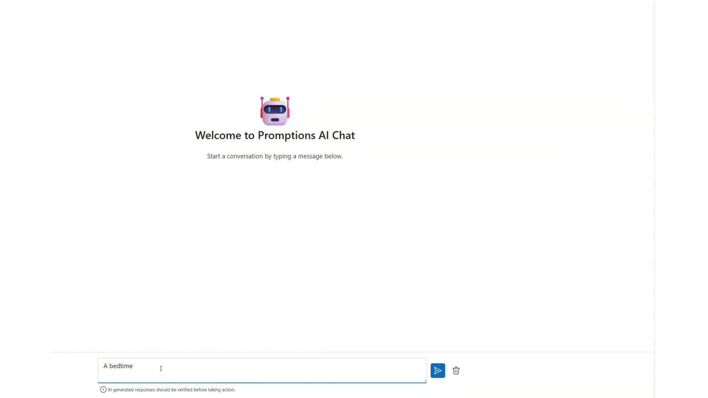

# Promptions - Ephemeral UI for Prompting

Ephemeral UI for prompt refinement - turn one prompt into interactive controls to steer and refine AI.


## Overview

Promptions is a simple, flexible **dynamic prompt middleware technique for AI** that uses **ephemeral UI**, developed by the ENCODE and [Tools for Thought](https://aka.ms/toolsforthought) projects at [Microsoft Research, Cambridge, UK](https://www.microsoft.com/en-us/research/lab/microsoft-research-cambridge/). From a single, simple prompt, the system helps users steer the AI by suggesting parameterized choices as dynamically generated, ephemeral UI components. As users click on choices, the same output updates immediately—not just as additional chat responses. The dynamic UI can be configured per prompt.

- For more on what Promptions can do, and for responsible AI suggestions, see our [TRANSPARENCY_NOTE.md](TRANSPARENCY_NOTE.md).
- A detailed discussion of Promptions, including how it was developed and tested, can be found in our research paper "[Dynamic Prompt Middleware: Contextual Prompt Refinement Controls for Comprehension Tasks](https://aka.ms/promptionspaper)."

Promptions is best suited for end-user interfaces where parameterizing prompts adds context that helps steer outputs toward user preferences, without requiring users to write or speak that context. The technique is simple yet effective, and it is easy to customize for many applications—serving developers from individual vibe coders to enterprise teams.

| Real-world use                        | Description                                                                                                                                                                                     |
| ------------------------------------- | ----------------------------------------------------------------------------------------------------------------------------------------------------------------------------------------------- |
| Customer support chatbots             | Users refine support queries on the fly (e.g., specify tone or detail level) and see updated answers instantly, improving resolution speed and satisfaction.                                    |
| Content creation platforms            | Writers and marketers tweak style, length, or format parameters through GUI controls, iterating drafts faster while maintaining creative direction.                                             |
| Data analytics and BI dashboards      | Analysts adjust filters, aggregation levels, or visualization styles via checkboxes and sliders, regenerating AI-driven reports and insights instantly.                                         |
| Educational tutoring systems          | Students select difficulty, focus topics, or feedback style, prompting the AI tutor to adapt explanations and examples to individual learning needs.                                            |
| Healthcare decision-support tools     | Clinicians refine symptom context, risk factors, or treatment priorities through guided options, obtaining tailored diagnostic suggestions and care pathways.                                   |
| Data annotation and curation          | Promptions can parameterize labeling decisions into structured GUI inputs (e.g. sentiment sliders, style toggles), improving consistency, speed, and auditability in dataset creation.          |
| Interactive explainability & auditing | Promptions allows users to explore how AI outputs shift with different refinement choices, offering a lightweight way to probe bias, model boundaries, or failure modes through UI interaction. |
| Human-AI co-creation experiments      | Promptions enables controlled studies of creative workflows—researchers can observe how users interact with dynamic controls vs. freeform input when generating stories, resumes, or code.      |

## Project Structure

```
promptions/
├── apps/                          # Frontend applications
│   ├── promptions-chat/           # Chat interface (port 3003)
│   └── promptions-image/          # Image generation interface (port 3004)
├── packages/                      # Shared libraries
│   ├── promptions-llm/            # LLM utilities and integrations
│   └── promptions-ui/             # Shared React UI components
├── package.json                   # Root package configuration
├── nx.json                        # NX build system configuration
└── tsconfig.json                  # TypeScript configuration
```

## Prerequisites

Before building and running this project, ensure you have:

- **Node.js** (v18 or higher)
- **Corepack** (included with Node.js v16.10+, enables automatic Yarn management)
- **TypeScript** (v5.0 or higher)
- **OpenAI API Key** (for chat and image generation features)

### Setting up Corepack (Recommended)

This project uses **Yarn 4.9.1** which is automatically managed via corepack. No manual Yarn installation needed!

```bash
# Enable corepack (if not already enabled)
corepack enable

# Verify corepack is working (should show yarn 4.9.1)
corepack yarn --version
```

> **Note:** Corepack is included with Node.js v16.10+ but may need to be enabled. If you're using an older Node.js version, you can install corepack separately: `npm install -g corepack`

### Alternative: Manual Yarn Installation

If you prefer not to use corepack:

```bash
# Install Yarn globally
npm install -g yarn@4.9.1
```

## Quick Start

### 1. Clone and Install Dependencies

```bash
# Clone the repository
git clone <repository-url>
cd promptions

# Enable corepack (if not already enabled and using corepack)
corepack enable

# Install all dependencies across the monorepo
# Corepack will automatically use the correct Yarn version (4.9.1)
yarn install
```

### 2. Build the Project

```bash
# Build all packages and applications
yarn build
```

### 3. Run the applications (and set your API key)

Set your OpenAI API key so the apps can call the OpenAI APIs.

Option A — .env files (recommended for local development):

- Create `apps/promptions-chat/.env` with:

    ```dotenv
    VITE_OPENAI_API_KEY=your_openai_api_key_here
    ```

- Create `apps/promptions-image/.env` with:

    ```dotenv
    VITE_OPENAI_API_KEY=your_openai_api_key_here
    ```

Option B — set it in your shell (PowerShell example):

```powershell
# Chat app
$env:VITE_OPENAI_API_KEY="your_openai_api_key_here" ; yarn workspace @promptions/promptions-chat dev

# Image app
$env:VITE_OPENAI_API_KEY="your_openai_api_key_here" ; yarn workspace @promptions/promptions-image dev
```

Start the dev servers:

- Chat application (http://localhost:3003):

    ```powershell
    yarn workspace @promptions/promptions-chat dev
    ```

- Image generation application (http://localhost:3004):

    ```powershell
    yarn workspace @promptions/promptions-image dev
    ```

## Available Commands

### Root Level Commands

| Command               | Description                                      |
| --------------------- | ------------------------------------------------ |
| `yarn build`          | Build all packages and applications              |
| `yarn typecheck`      | Run TypeScript type checking across all projects |
| `yarn clean`          | Clean all build artifacts                        |
| `yarn prettier:check` | Check code formatting                            |
| `yarn prettier:write` | Format code                                      |

### Individual Package Commands

Each package supports these commands:

| Command                                   | Description                          |
| ----------------------------------------- | ------------------------------------ |
| `yarn workspace <package-name> build`     | Build specific package               |
| `yarn workspace <package-name> typecheck` | Type check specific package          |
| `yarn workspace <package-name> clean`     | Clean build artifacts                |
| `yarn workspace <package-name> dev`       | Start development server (apps only) |
| `yarn workspace <package-name> preview`   | Preview production build (apps only) |

### Package Names

- `@promptions/promptions-chat`
- `@promptions/promptions-image`
- `@promptions/promptions-llm`
- `@promptions/promptions-ui`

## CONTRIBUTING

This project welcomes contributions and suggestions. For information about contributing to Promptions, please see our [CONTRIBUTING.md](CONTRIBUTING.md) guide, which includes current issues to be resolved and other forms of contributing.

## CONTACT

We welcome feedback and collaboration from our audience. If you have suggestions, questions, or observe unexpected/offensive behavior in our technology, please contact us at [promptionsgithub@service.microsoft.com](promptionsgithub@service.microsoft.com).

If the team receives reports of undesired behavior or identifies issues independently, we will update this repository with appropriate mitigations.

## TRADEMARKS

Microsoft, Windows, Microsoft Azure, and/or other Microsoft products and services referenced in the documentation may be either trademarks or registered trademarks of Microsoft in the United States and/or other countries. The licenses for this project do not grant you rights to use any Microsoft names, logos, or trademarks. Microsoft's general trademark guidelines can be found at http://go.microsoft.com/fwlink/?LinkID=254653.

Any use of third-party trademarks or logos are subject to those third-party's policies.

## PRIVACY & ETHICS

Privacy information can be found at https://go.microsoft.com/fwlink/?LinkId=521839
